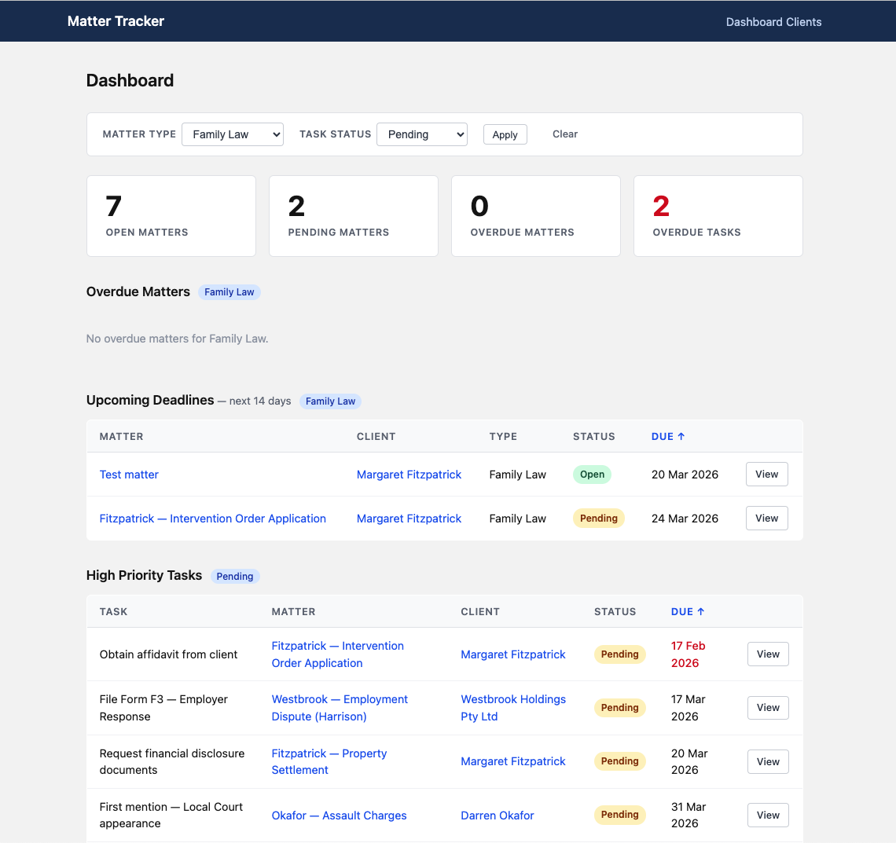
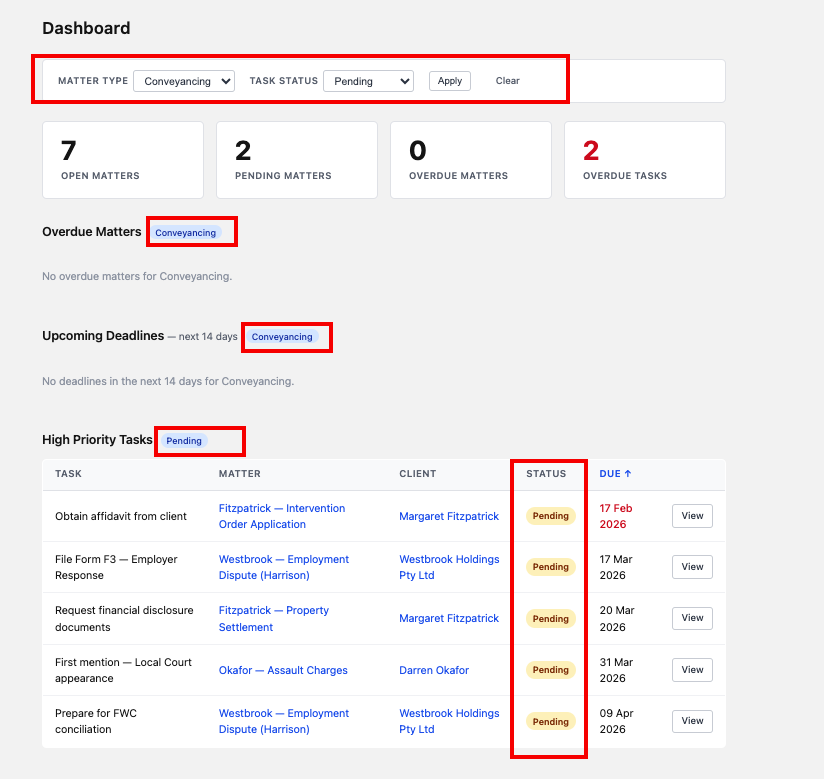
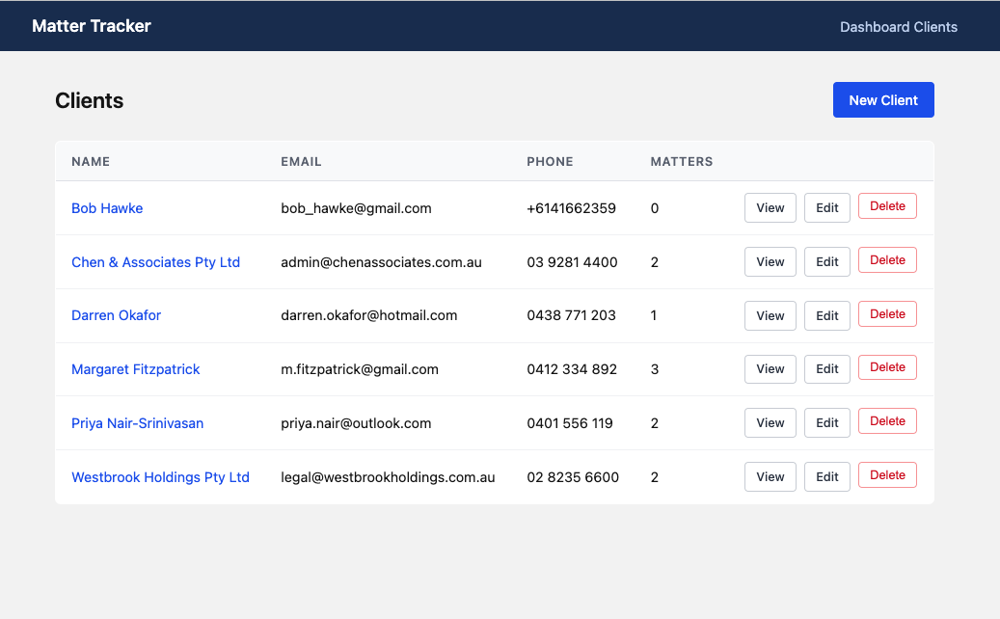
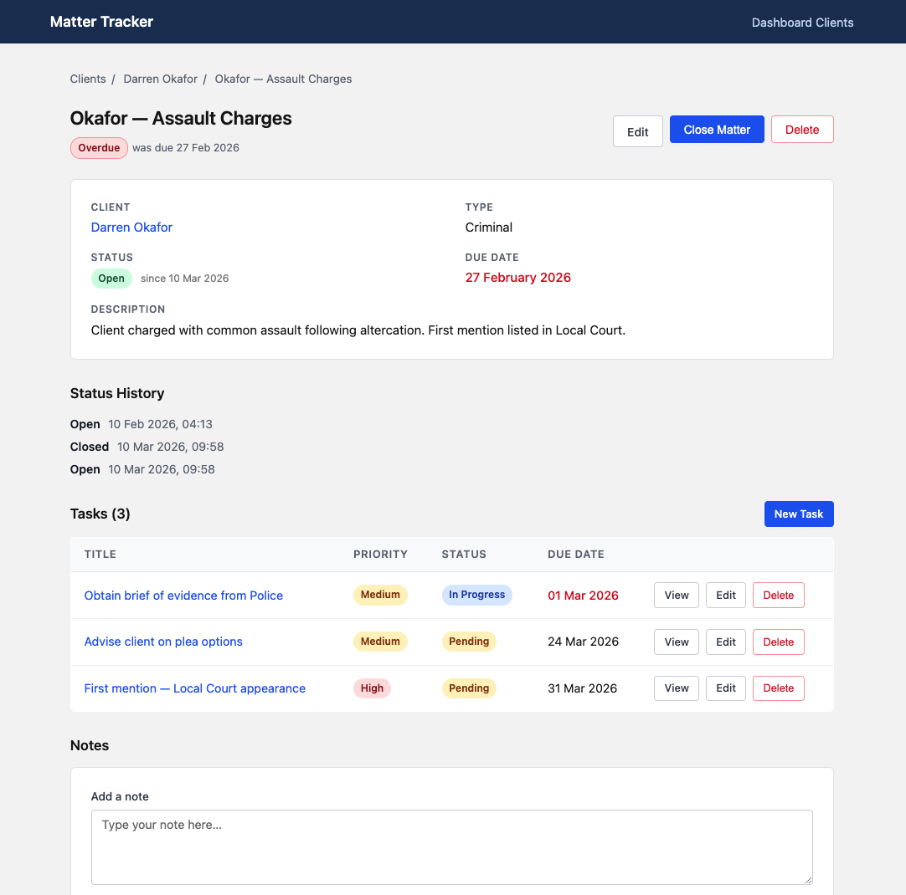
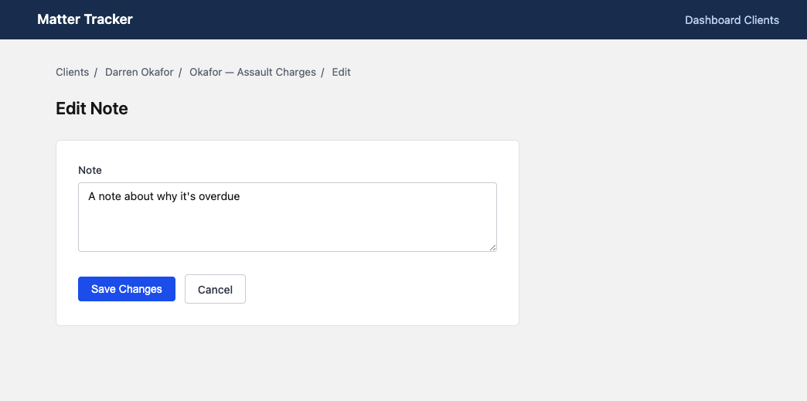

# Matter Tracker

I'm applying for a role at [Clio](https://www.clio.com/au/) — legal practice management software — and wanted to show up with more than a CV. So I built this: a stripped-back version of what Clio does, just to prove I understand the domain and can put together a real Rails app.

It's a CRUD app for tracking legal matters. Clients have matters (cases), matters have tasks and notes, everything has a status and a due date. Not reinventing the wheel — just demonstrating I can work with the same basic concepts Clio is built around.

Built with the help of [Claude Code](https://claude.ai/code), Anthropic's AI coding tool, which I used as a pair programmer throughout — writing code alongside it, reviewing what it produced, and guiding it when it went off track.

---

## What it does

- **Dashboard** — stat cards (open/pending/closed matters, overdue task count), overdue matters, upcoming deadlines, and high-priority tasks; filterable by matter type and task status, all columns sortable
- **Clients** — create and manage clients; overdue matter due dates highlighted on the client page
- **Matters** — track legal matters by type, status, and due date; close and reopen with full status history; overdue badge shown when past due and still open
- **Tasks** — attach tasks to matters with priority and status; overdue indicator on past-due incomplete tasks
- **Notes** — add notes to any matter, displayed inline

## Screenshots

<!--
  HOW TO ADD SCREENSHOTS:
  1. Take your screenshots and save them into a /screenshots folder in the repo root
  2. Replace each placeholder below with the actual image path
  3. Syntax: 

  WHAT TO CAPTURE:
  - Dashboard with seed data loaded (shows stat cards + all three tables)
  - A matter show page — ideally one that's overdue (shows the red badge + status history)
  - A client show page — shows the matters table with an overdue date in red
  - Optional: the filter bar in use (matter_type selected, filtered results showing)
-->

**Dashboard**


**Dashboard — filtered by matter type and priority **


**Overdue matter**


**Client page**


**Matter detail**


**Editing a note**


---

## Data Model

```
Client             → has many Matters
Matter             → belongs to Client, has many Tasks, has many Notes, has many MatterStatusChanges
Task               → belongs to Matter
Note               → belongs to Matter
MatterStatusChange → belongs to Matter (audit log, written automatically on every status change)
```

## How data flows through the app

Rails uses the MVC pattern — every request passes through three layers:

- **Routes** (`config/routes.rb`) — maps a URL + HTTP verb to a controller action. `POST /clients/21/matters` → `MattersController#create`
- **Controller** — receives the request, talks to the model to read or write data, then sends a response (renders a view or redirects)
- **Model** — the Ruby class that wraps the database table. Handles validations, associations, and business logic (e.g. the `close` method, status change callbacks)
- **View** — an ERB template that takes the data the controller prepared and renders HTML back to the browser

```
Browser → Routes → Controller → Model ↔ Database
                       ↓
                     View → Browser
```

## Setup

```bash
git clone <repo-url>
cd matter_tracker
bundle install
rails db:create db:migrate db:seed
rails server
```

Visit `http://localhost:3000`

## Tests

```bash
bundle exec rspec
```

## Stack

- Rails 7.0 with SQLite3
- RSpec + FactoryBot for testing
- Shallow nested routes
- Hotwire/Turbo (no JS framework)

## What's missing (intentionally)

This is a proof-of-concept, not a production app. The obvious next steps would be authentication, time tracking, document uploads, and a proper calendar view — all things Clio does well.
